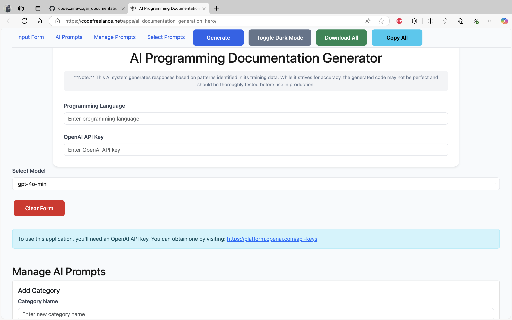
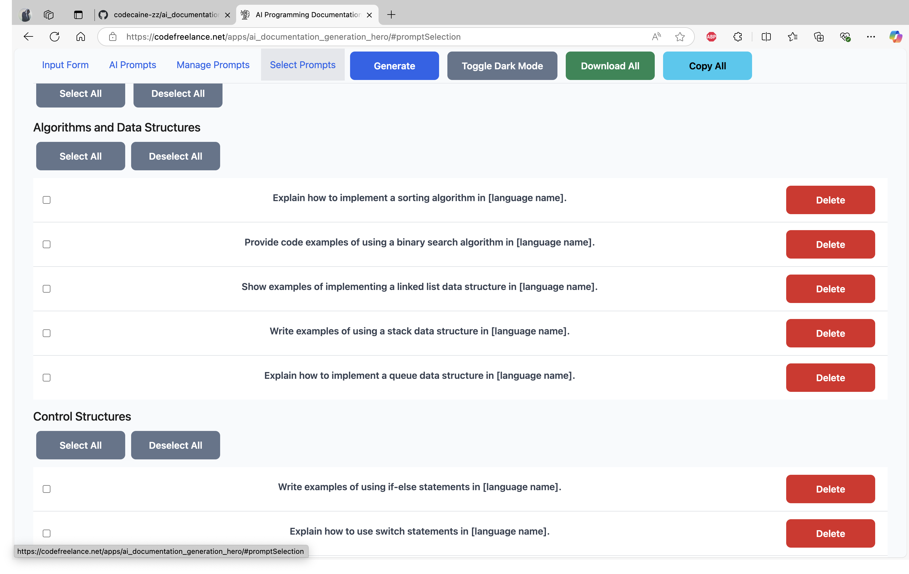
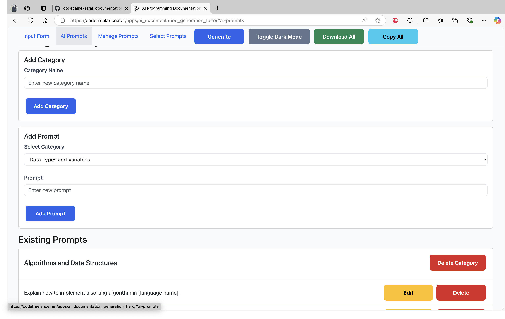
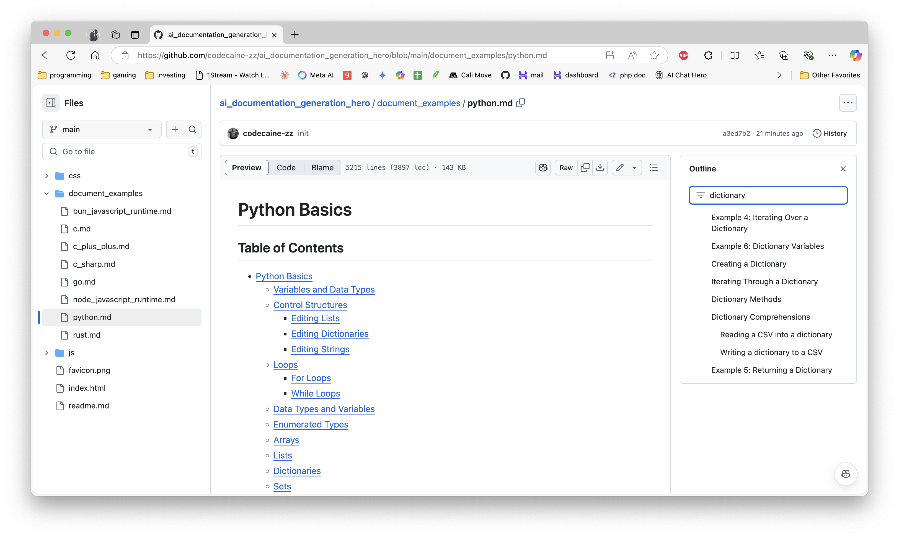

# AI Programming Documentation Generator

This application allows you to generate programming documentation using AI.

## Developer Note

I used VSCode Edit with Copilot to create title navigations for the download markdown.

**Note**: This document can run on any VSCode extension Live Server. It can also be loaded in PyWebView for Python or Neutralinojs for a desktop application.

**Note**: You can copy and paste the default prompts in VSCode with Copilot to generate different ones for any specific language. The `defaultPrompts` can be found in `index.js` in the `js` folder.

**Note**: You can use the Markdown Preview Enhanced extension to navigate the markdown easily.

## Features of the GUI

- **Input Form**: Allows users to input the programming language and OpenAI API key.
- **Model Selection**: Users can select from predefined models or enter a custom model.
- **Theme Toggle**: Toggle between light and dark mode.
- **Generate Button**: Generates documentation based on selected prompts.
- **Download All Button**: Downloads all generated documentation as a text file.
- **Copy All Button**: Copies all generated documentation to the clipboard.
- **Clear Form Button**: Clears the input form.
- **Manage Prompts**: Add, edit, and delete categories and prompts.
- **Select Prompts**: Select specific prompts to generate documentation.
- **Navigation Menu**: Quick navigation to different sections of the page.
- **Full-Screen Loader**: Displays a loading spinner while generating documentation.

## Getting Started

To use this application, you'll need an OpenAI API key. You can obtain one by visiting:
https://platform.openai.com/api-keys

## Top Navigation Bar

The top navigation bar allows you to move around the application quickly. It includes buttons that are needed often, ensuring they are always on the screen for productivity.

## Document Examples

Look in the `document_examples` folder to see examples for Python, Bun JavaScript, and Node.js JavaScript. Additional examples may be added in the future.

## Application Screenshots

Here are some screenshots of the application:

## Github markdown filter screenshot

